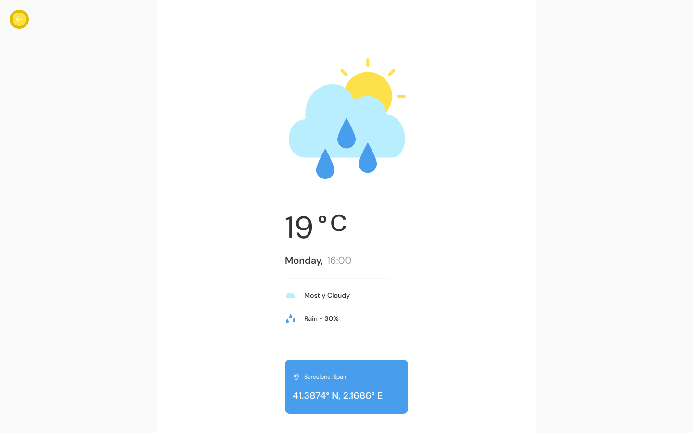

# Express.js / React developer assessment
This assessment tests your developer competency. 

## Your task
Create a simple web application with a RESTful API service built in Express.js and React using the Open Weather Map API (https://home.openweathermap.org/). You can sign up for a free API Key on their website here: https://home.openweathermap.org/users/sign_up

The application can be split into two folders:
* service - The Express.js application
* app - The React application

Create a Github public repository for the application, also share access to this repo to me@nickbester.com

**You have to make commits every time you create a specific feature - We want to see some indication of Git knowledge**

### The Express.js application
Your Express.js service needs to wrap the current weather API and accept a city name as a parameter. This is the API URL for the service (note the city name and API parameters that need to be passed):
api.openweathermap.org/data/2.5/weather?q={city name}&appid={API key}

The Express.js service should be protected with a client secret to prevent anything but your React application from using it. This means that your API key and your client secret need to be environment variables and should not be part of your application code.

### The React application
We don't mind what version of React you're going to use other than it shouldn't be two versions older than the current (https://www.reactjs.rg)

Your React app doesn't need to look like the Mona Lisa, we're more interested in how you structure your code and if you're implementing best practise. Your application should have the following:
* An input field that lets a user type in a city name: Example: "Hong Kong"
* A submit button that requests the data from the Express.js endpoint you created
* You should display a simple loading message while the API request is made using a Font Awesome spinner icon - https://fontawesome.com/ (This means you'll need to import the Font awesome icon library to make use of it)
* Your Express.js service should be defined as a Service within React that is injected into your Component
* You should display the current weather data supplied by the API
* You should make use of SCSS as a pre-compiler 
* The designs below should be followed for the application, a Figma link is provided
	* https://www.figma.com/file/UBMkC1wLwSroOfqJsA5yG7/HelloComputer---Weather-Dashboard?node-id=1%3A2

#### Here is a simple slow of how you application should work. 
##### The user is presented with an input field and a submit button.

##### When a user enters a city name, and taps the submit button a loading icon should appear

##### Once the data has been retrieved from your Express.js service, the information should display to the user.

You can host your application on Heroku for free and send a link to nick.bester@hellocomputer.com

Happy coding!
